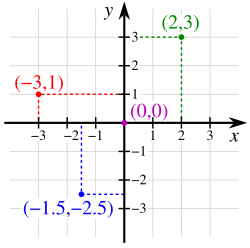
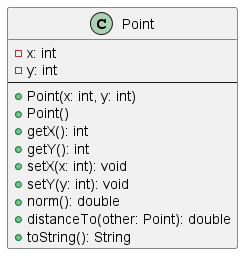
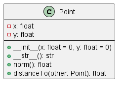

# Java vs. Python — POO (sin herencia)

La siguiente tabla compara los **principales aspectos de Programación Orientada a Objetos (POO)** entre **Java** y **Python**, **sin cubrir herencia**.

## Tabla comparativa

| Concepto clave  | Java  | Python   | Pasos para convertir|
| ---- | ---- | ---- | ---- |
| **Definir clase**  | `class Persona { ... }`| `class Persona:` | Quitar llaves `{}` y usar sangría.                            |
| **Constructor**  | Nombre igual a la clase, p.ej. `public Persona(...)` | `def __init__(self, ...):` | Cambiar nombre al método `__init__` y agregar `self`.|
| **Atributos** | Declarados arriba con tipo: `private int edad;`| Se crean en `__init__` con `self.edad = edad` | Eliminar tipo y usar `self.` para crearlos. |
| **Métodos** | `public void saludar() { ... }` | `def saludar(self):` | Quitar tipo de retorno, agregar `self` como primer parámetro. |
| **Acceso a atributos** | `this.edad` | `self.edad` | Cambiar `this` por `self`. |
| **Visibilidad** | `public`, `private`, `protected`  | Convenciones: público (`nombre`), protegido (`_nombre`), privado (`__nombre`) | Python no obliga, solo usa convención. |
| **Constantes** | `public static final int X = 5;`  | `X = 5` (en mayúsculas)   | Declarar en mayúsculas a nivel de clase o módulo.             |
| **Método estático**    | `public static void foo()` | `@staticmethod` arriba del método  | No lleva `self`. |
| **Imprimir**  | `System.out.println(x);` | `print(x)` | Cambiar por `print()`.|
| **Punto de entrada**   | `public static void main(String[] args)` | `if __name__ == "__main__":` | Poner el código a ejecutar bajo esa condición. |


## Ejemplo equivalente: clase `Point`

<p align="center">
  
</p>

### Java

#### Diagrama de clase

<p align="center">
  
</p>


#### Codigo fuente

```java
// Point.java
public class Point {
    private int x;
    private int y;

    // --- Constructores ---
    public Point(int x, int y) {
        this.x = x;
        this.y = y;
    }

    
    public Point() {
        this(0, 0); // Llama al otro constructor
    }

    // --- Getters ---

    public int getX() {
        return this.x;
    }

    public int getY() {
        return this.y;
    }

    // --- Setters ---

    public void setX(int x) {
        this.x = x;
    }

    public void setY(int y) {
        this.y = y;
    }

    public double norm() {
        return Math.hypot(x, y);
    }
    
    public distanceTo(Point other) {
        return Math.hypot(this.x - other.x, this.y - other.y)


    @Override
    public String toString() {
        return "(" + this.x + ", " + this.y + ")";
    }

    public static void main(String[] args) {
        Point p1 = new Point(5, 3);
        Point p2 = new Point(); 
    
        System.out.println("Punto 1: " + p1); 
        System.out.println("|Punto 1|: " + p1.norm()); 
        System.out.println("Punto 2: " + p2); 
        System.out.println("|Punto 2|: " + p2.norm()); 
        System.out.println("distancia(p1, p2): " + p1.distanceTo(p2));


        p2.setX(-2);
        p2.setY(8);
        System.out.println("Punto 2: " + p2); 
        System.out.println("|Punto 2|: " + p2.norm()); 
        System.out.println("distancia(p1, p2):" + p1.distanceTo(p2));
    }
}
```

### Python

#### Diagrama de clase

<p align="center">
  
</p>


#### Codigo fuente

```python
# point.py
class Point:
    
    def __init__(self, x=0, y=0):    
        self.x = x
        self.y = y

    def __str__(self):
        return f"({self.x}, {self.y})"

    def norm(self):
        return (self.x**2 + self.y**2)**0.5

    def distanceTo(self, other):
        return ((self.x - other.x)**2 + (self.y - other.y)**2)**0.5
  

if __name__ == "__main__":
    p1 = Point(5, 3)
    p2 = Point()  

    print(f"Punto 1: {p1}")  
    print(f"|Punto 1|: {p1.norm()}")  
    print(f"Punto 2: {p2}")  
    print(f"|Punto 2|: {p2.norm()}")  
    print(f"distancia(p1, p2): {p1.distanceTo(p2)}")  


    p2.x = -2
    p2.y = 8
    print(f"Punto 2: {p2}") 
    print(f"|Punto 2|: {p2.norm()}")
    print(f"distancia(p1, p2): {p1.distanceTo(p2)}") 
```

# Actividad 

Hacer un refactoring de las clases ejemplo vistas en clase.

ToDo...