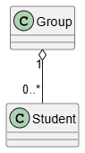
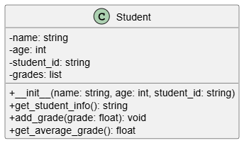
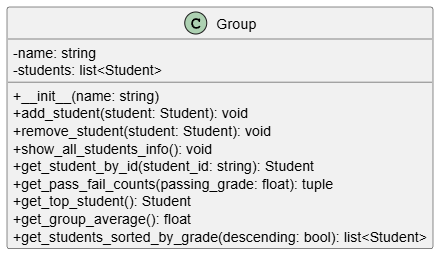

# Ejemplo de aplicación - Sistema de Gestión de Notas

Este proyecto es una aplicación de consola en Python diseñada para administrar las notas y la información de un grupo de estudiantes. Sirve como una herramienta de doble propósito, ofreciendo una interfaz para profesores con control administrativo total y una vista restringida para que los estudiantes consulten su propia información.

## Caracteristicas principales

### Doble Rol de Usuario

- **Vista de Profesor (admin)**: Permite una gestión completa del grupo, incluyendo visualización de rankings, cálculo de estadísticas, búsqueda de estudiantes, adición de nuevos alumnos y la capacidad de guardar los cambios.
- **Vista de Estudiante**: Ofrece un acceso seguro y privado donde cada estudiante, usando su ID, solo puede consultar sus propias notas y promedio.

### Gestión de Datos con CSV

- La información de los estudiantes se carga al inicio desde un archivo `grades.csv`.
- El profesor puede guardar cualquier modificación (como agregar un nuevo estudiante) de vuelta al archivo CSV, asegurando la persistencia de los datos entre sesiones.

### Estructura Modular

- El código está organizado en dos archivos principales para una clara separación de responsabilidades:
  1. `gestion_estudiantes.py`: Actúa como el backend o motor. Contiene la lógica de negocio y las definiciones de las clases Student y Group.
  2. `main.py`: Funciona como el frontend o la interfaz de usuario. Gestiona los menús interactivos, la entrada del usuario y la comunicación con el motor.

## Estructura del proyecto

El sistema se compone de los siguientes archivos:

* [`main.py`](./scripts/main.py):
  * Es el punto de entrada que se debe ejecutar.
  * Maneja el "login" inicial para diferenciar entre profesor y estudiante.
  * Presenta los menús correspondientes a cada rol y gestiona la interacción con el usuario.

* [`gestion_estudiantes.py`](./scripts/gestion_estudiantes.py):
  * Define la clase `Student` para encapsular los datos de un alumno (nombre, ID, notas) y sus comportamientos (calcular promedio).
  * Define la clase `Group` para gestionar la colección de estudiantes y realizar operaciones sobre el grupo (ranking, estadísticas, búsquedas).
  * Incluye funciones para leer y escribir los datos desde y hacia el archivo `grades.csv`.

* [grades.csv](./scripts/grades.csv):
  * Es la "base de datos" del proyecto.
  * Almacena la información de los estudiantes en un formato de texto plano separado por punto y coma (`;`).

## Cómo Empezar

Para ejecutar este proyecto, asegúrese de tener Python instalado y los archivos `main.py`, `gestion_estudiantes.py`, y `grades.csv` en la misma carpeta del proyecto. Luego, empleando el IDE de su preferencia, localice, abra y ejecute el archivo `main.py`. Si todo esta en orden el programa empezara su ejecución en consola.

## Sobre el codigo

A continuación se describen las principales clases y modulos que se emplean en el proyecto.

### Clases

El siguiente diagrama UML muestra las clases definidas en el proyecto y la relacion entre estas.

  

A continuación, se describe con un poco mas de detalle la información sobre las clases `Student` y `Group` previamente implementadas.

#### Clase `Student`

Representa a un único estudiante y sus datos asociados.

  

La siguiente tabla muestra los principales metodos de esta clase:

| Operación / Método | Descripción |
| :--- | :--- |
| `Student(name, age, student_id)` | **Constructor**: Crea un nuevo objeto `Student` con nombre, edad, ID y una lista de notas vacía. |
| `get_student_info()` | Devuelve un `string` con la información básica del estudiante (nombre, edad e ID). |
| `add_grade(grade)` | Agrega una única nota (`grade`) a la lista de notas del estudiante. |
| `get_average_grade()` | Calcula y devuelve el promedio numérico de las notas del estudiante. Devuelve `0` si no tiene notas. |

#### Clase `Group`

Representa un grupo o curso que contiene una colección de objetos `Student`.

  

A continuación se muestran los principales metodos de esta clase:

| Operación / Método | Descripción |
| :--- | :--- |
| `Group(name)` | **Constructor**: Crea un nuevo objeto `Group` con un nombre y una lista de estudiantes vacía. |
| `add_student(student)` | Agrega un objeto `Student` a la lista de estudiantes del grupo. |
| `remove_student(student)` | Elimina un objeto `Student` de la lista de estudiantes del grupo, si existe. |
| `show_all_students_info()` | Imprime en la consola la información y el promedio de cada estudiante del grupo. |
| `get_student_by_id(student_id)` | Busca y devuelve el objeto `Student` que coincida con el `student_id`. Devuelve `None` si no lo encuentra. |
| `get_pass_fail_counts(passing_grade)`| Devuelve una tupla `(aprobados, reprobados)` contando los estudiantes según una nota de corte (`passing_grade`). |
| `get_top_student()` | Devuelve el objeto `Student` con el promedio de notas más alto de todo el grupo. |
| `get_group_average()` | Calcula y devuelve el promedio numérico de las notas de todos los estudiantes del grupo. |
| `get_students_sorted_by_grade()` | Devuelve una **nueva lista** con los estudiantes del grupo ordenados por su promedio (de mayor a menor por defecto). |

### Funciones de Módulo

Para la manipulación de los archivos, el modulo (`gestion_usuarios.py`) posee funciones auxiliares para la carga y guardado de datos. La siguiente tabla hace una descripción de estas.

| Operación / Método | Descripción |
| :--- | :--- |
| `load_students_from_csv(file_path)` | Lee un archivo CSV, crea objetos `Student` por cada fila y devuelve una lista con todos ellos. |
| `save_students_to_csv(file_path, group)`| Guarda la lista de estudiantes de un objeto `Group` en un archivo CSV, sobrescribiendo el contenido anterior. |

> [!Note]
> **AI Disclosure:** This document was created with the assistance of Artificial Intelligence language models. The content has been reviewed, edited, and validated by a human author to ensure accuracy and quality.