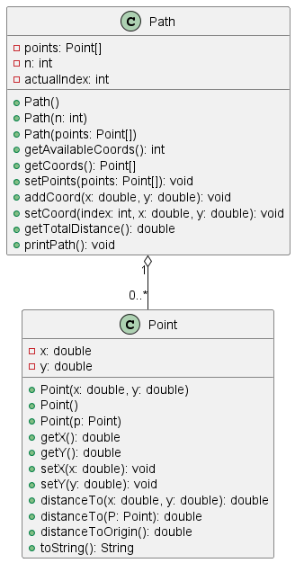

# Descripción del Proyecto

Este proyecto contiene un conjunto de clases de Java diseñadas para ilustrar los principios fundamentales de la Programación Orientada a Objetos. Se implementan las clases `Point` y `Path` para representar coordenadas geométricas y trayectorias.

El objetivo es proporcionar un ejemplo claro sobre la definición de clases, la interacción entre objetos y el manejo de colecciones de datos. Específicamente, la clase `Path` utiliza un array de objetos `Point` para almacenar la secuencia de coordenadas que conforman una ruta, demostrando así el uso de esta estructura de datos fundamental.


Claro, aquí tienes el README.md actualizado para reflejar la ejecución en un IDE y mencionar el uso de arrays.

README
Descripción del Proyecto
Este proyecto contiene un conjunto de clases de Java diseñadas para ilustrar los principios fundamentales de la Programación Orientada a Objetos. Se implementan las clases Point y Path para representar coordenadas geométricas y trayectorias. 🗺️

El objetivo es proporcionar un ejemplo claro sobre la definición de clases, la interacción entre objetos y el manejo de colecciones de datos. Específicamente, la clase Path utiliza un array de objetos Point para almacenar la secuencia de coordenadas que conforman una ruta, demostrando así el uso de esta estructura de datos fundamental.

## Contenido del proyecto

El proyecto se compone de los siguientes archivos fuente (`.java`):
* **`Point.java`**: Define una clase para representar un punto en un plano bidimensional (x, y). Incluye métodos para calcular distancias.
* **`Path.java`**: Define una clase para representar una trayectoria como una secuencia ordenada de objetos `Point` almacenados en un array. Incluye métodos para agregar coordenadas y calcular la longitud total del camino.
* **`TestPoint.java`**: Clase ejecutable (`main`) que demuestra la creación y uso de la clase `Point`.
* **`TestPath.java`**: Clase ejecutable (`main`) que demuestra la creación y uso de la clase `Path`.

Para dar una idea del codigo, en el siguiente diagrama se muestra el diagrama UML para las clases `Point.java` y `Path.java`:


<p align="center">
    
</p>

## Requisitos previos

Para compilar y ejecutar este proyecto, es indispensable tener:
1. **Un Kit de Desarrollo de Java (JDK)** en su versión 8 o superior.
2. **Un Entorno de Desarrollo Integrado (IDE)** compatible con Java, como Apache NetBeans, IntelliJ IDEA, Eclipse o Visual Studio Code con el pack de extensiones para Java.

## Salida Esperada

### Ejecución de `TestPoint.java`

La consola del IDE deberá mostrar el siguiente resultado:

```
P(0.0,0.0)
Q(2.0,8.0)
R(-2.0,4.0)
Distancia PQ: 8.246211251235321
Distancia QR: 5.656854249492381
Distancia de R al origen: 4.47213595499958
```

### Ejecución de `TestPath.java`

La consola del IDE deberá mostrar el siguiente resultado:

```
Coordenada (0.0,0.0) agregada a la ruta
Coordenada (1.0,1.0) agregada a la ruta
Coordenada (4.0,4.0) agregada a la ruta
Coordenada (4.0,5.0) agregada a la ruta
La capacidad maxima de puntos se ha superado
Puntos registrados en la ruta: 
-> (0.0,0.0)
-> (1.0,1.0)
-> (4.0,4.0)
-> (4.0,5.0)
Registros disponibles: 0
Distancia total ruta 1: 6.656854249492381
Puntos registrados en la ruta: 
-> (0.0,0.0)
-> (1.0,1.0)
-> (4.0,4.0)
-> (4.0,5.0)
Registros disponibles: 0
Coordenada 0 cambiada: (0.0,0.0) -> (2.5,-1.5)
Puntos registrados en la ruta: 
-> (2.5,-1.5)
-> (1.0,1.0)
-> (4.0,4.0)
-> (4.0,5.0)
Registros disponibles: 0
Fin
```