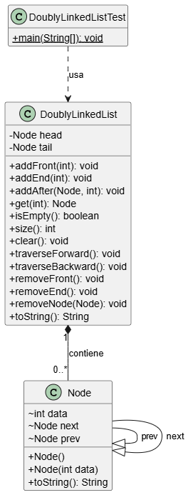

# Lista Doblemente Enlazada (Doubly Linked List)

Este directorio contiene una implementación en Java de una **Lista Doblemente Enlazada** (`DoublyLinkedList`). A diferencia de una lista enlazada simple, cada nodo en esta estructura de datos mantiene una referencia tanto al nodo siguiente como al nodo anterior.

## Descripción del Proyecto

El objetivo de este ejemplo es proporcionar una implementación clara y funcional de una lista doblemente enlazada. Esta estructura permite recorridos eficientes en ambas direcciones (hacia adelante y hacia atrás) y simplifica las operaciones de inserción y eliminación en comparación con una lista enlazada simple, ya que no es necesario recorrer la lista para encontrar el nodo previo.

La clase `DoublyLinkedListTest` sirve como punto de entrada para demostrar las operaciones principales de la lista, como agregar, obtener y eliminar nodos.

## Archivos del Proyecto

- **`Node.java`**: Define la estructura de un nodo, que contiene un dato (`data`) y dos referencias: `next` (al siguiente nodo) y `prev` (al nodo anterior).
- **`DoublyLinkedList.java`**: Contiene la lógica de la lista doblemente enlazada, incluyendo métodos para:
  - `addFront()`, `addEnd()`: Agregar nodos al inicio y al final.
  - `addAfter()`: Insertar un nodo después de otro existente.
  - `removeFront()`, `removeEnd()`, `removeNode()`: Eliminar nodos.
  - `get()`: Buscar un nodo por su valor.
  - `traverseForward()`, `traverseBackward()`: Recorrer la lista en ambas direcciones.
- **`DoublyLinkedListTest.java`**: Clase principal con el método `main` que crea una instancia de la lista y prueba sus funcionalidades.

## Diagrama de Clases (UML)

El siguiente diagrama UML ilustra la relación entre las clases `DoublyLinkedList` y `Node`.

<p align="center">
  
</p>

## Cómo Ejecutar

Para probar el ejemplo, compila todos los archivos `.java` y luego ejecuta la clase `DoublyLinkedListTest`.

```bash
javac *.java
java DoublyLinkedListTest
```

La salida del programa demostrará la creación, manipulación y recorrido de la lista doblemente enlazada.