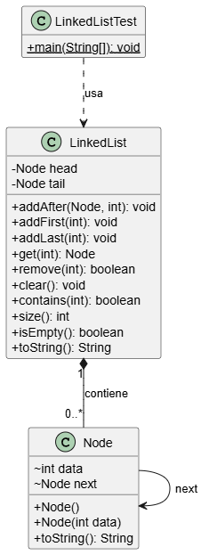

# Resumen de archivos del directorio `LL`

## Clases

- **``LinkedListL.java``**: Clase principal que implementa una lista enlazada simple, con métodos para insertar, eliminar y mostrar elementos.
- **``Node.java``**: Define la estructura de un nodo de la lista enlazada, almacenando un valor y una referencia al siguiente nodo.
- **``Main.java``**: Contiene el método `main` para ejecutar y probar las funcionalidades de la lista enlazada.

## Diagrama de clases

  

