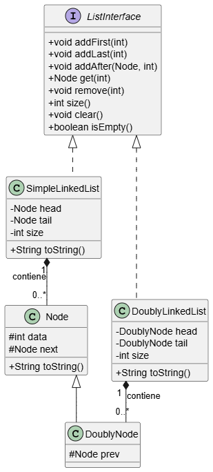

# Implementación de Listas con Interfaz

Este directorio contiene un ejemplo avanzado de estructuras de datos en Java que demuestra cómo utilizar una **interfaz (`ListInterface`)** para definir un contrato común para diferentes implementaciones de listas: una **Lista Simplemente Enlazada (`SimpleLinkedList`)** y una **Lista Doblemente Enlazada (`DoublyLinkedList`)**.

## Descripción del Proyecto

El objetivo principal es ilustrar los principios de **abstracción y polimorfismo** en la Programación Orientada a Objetos. Al definir un conjunto de métodos estándar en `ListInterface`, podemos garantizar que cualquier clase que la implemente ofrecerá la misma funcionalidad básica (agregar, eliminar, buscar, etc.), permitiendo que sean intercambiables en el código cliente.

El proyecto también demuestra el uso de la **herencia** con las clases `Node` y `DoublyNode`.

## Archivos del Proyecto

- **`ListInterface.java`**: Define el "contrato" que deben seguir todas las clases de listas. Especifica los métodos que deben ser implementados, como `addFirst()`, `addLast()`, `remove()`, etc.
- **`Node.java`**: Clase base que representa un nodo con un dato y una referencia al siguiente nodo (`next`).
- **`DoublyNode.java`**: Extiende de `Node` y añade una referencia al nodo anterior (`prev`), siendo la base para la lista doblemente enlazada.
- **`SimpleLinkedList.java`**: Implementación de `ListInterface` que utiliza `Node` para crear una lista enlazada simple.
- **`DoublyLinkedList.java`**: Implementación de `ListInterface` que utiliza `DoublyNode` para crear una lista doblemente enlazada, permitiendo recorridos en ambas direcciones.
- **`TestListInterface.java`**: Clase principal con el método `main` que crea instancias de `SimpleLinkedList` y `DoublyLinkedList` para demostrar que ambas pueden ser utilizadas de manera similar gracias a la interfaz común.

## Diagrama de Clases (UML)

El siguiente diagrama UML ilustra las relaciones de herencia e implementación entre las clases y la interfaz.

<p align="center">
  
</p>

## Cómo Ejecutar

Para probar el ejemplo, compila todos los archivos `.java` y ejecuta la clase `TestListInterface`:

```bash
javac *.java
java TestListInterface
```

La salida mostrará las operaciones realizadas sobre una instancia de `SimpleLinkedList` y luego sobre una de `DoublyLinkedList`, verificando su comportamiento.
