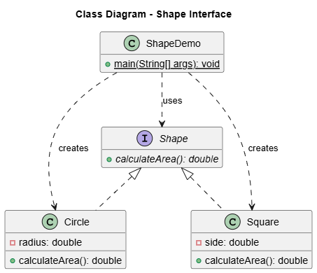

# Interfaz

Este directorio contiene un ejemplo práctico que demuestra el uso de interfaces en Java para lograr polimorfismo. El proyecto define una interfaz `Shape` y dos clases que la implementan: `Circle` y `Square`.

## Descripción del Proyecto

El objetivo de este ejemplo es mostrar cómo se puede definir un "contrato" (la interfaz `Shape`) que obliga a las clases a implementar un método específico (`calculateArea()`). Esto permite tratar objetos de diferentes clases (`Circle`, `Square`) de manera uniforme a través de la referencia de la interfaz.

La clase `ShapeDemo` crea instancias de `Circle` y `Square` y las trata como objetos `Shape`, invocando su método `calculateArea()` sin necesidad de conocer la clase concreta de cada objeto.

## Archivos del Proyecto

- **`Shape.java`**: Define la interfaz `Shape` con un único método abstracto, `calculateArea()`.
- **`Circle.java`**: Una clase que implementa la interfaz `Shape` y proporciona una implementación del método `calculateArea()` para un círculo.
- **`Square.java`**: Otra clase que implementa `Shape` y calcula el área para un cuadrado.
- **`ShapeDemo.java`**: La clase principal con el método `main` que demuestra el uso polimórfico de las clases que implementan `Shape`.

## Diagrama de Clases (UML)

El siguiente diagrama UML ilustra la relación entre la interfaz y las clases que la implementan.

<p align="center">
  
</p>

## Cómo Ejecutar

Para probar el ejemplo, compile todos los archivos `.java` y ejecute la clase `ShapeDemo`:

```bash
javac *.java
java ShapeDemo
```

